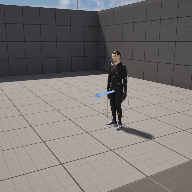

# Project Name LocalMultiPlayer03

## Description

A github repository for the in class demonstration code local multi-player.   
 
## Usage
Clone, or download the zip, to a local directory. Open in Unreal Engine 5.4 or newer

## Attributions
1) MarkerMan from Mixamo, ( https://mixamo.com )
2) Sword Lite and Locomotion animation packs, Mixamo, ( https://mixamo.com )

